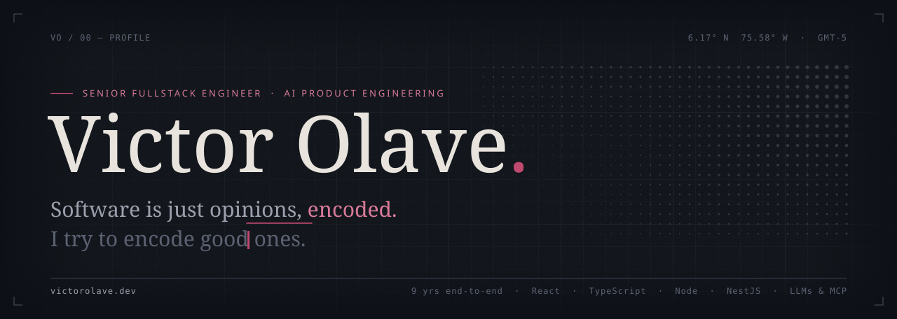
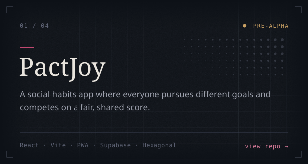
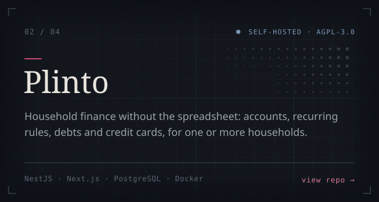
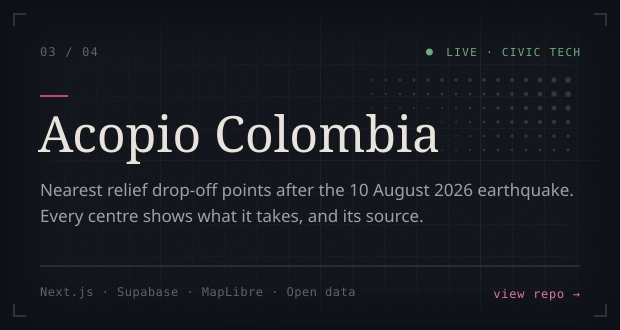
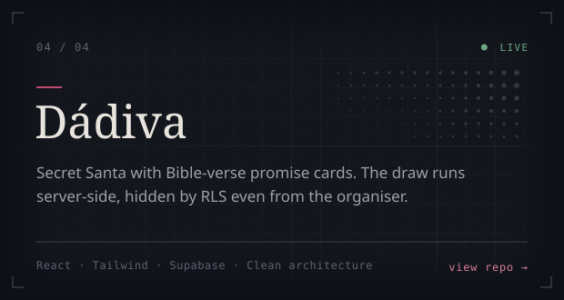

<a href="https://victorolave.dev">
  <picture>
    <source media="(prefers-color-scheme: light)" srcset="assets/banner-light.svg">
    
  </picture>
</a>

 

<samp>01 — ABOUT</samp>

### I design and build the systems behind useful products.

Nine years shipping end-to-end — React and TypeScript on the front, Node and
NestJS on the back — and now leaning hard into **AI-powered product
engineering**: LLMs, agents with MCP, RAG, prompt engineering as a product
discipline.

I question requirements before writing code, and I ship small, opinionated
things.

 

<samp>02 — CURRENTLY BUILDING</samp>

### Four things I'm shipping in the open.

<a href="https://github.com/victorolave/pactjoy"><picture><source media="(prefers-color-scheme: light)" srcset="assets/card-pactjoy-light.svg"></picture></a>
<a href="https://github.com/victorolave/plinto"><picture><source media="(prefers-color-scheme: light)" srcset="assets/card-plinto-light.svg"></picture></a>
<a href="https://github.com/victorolave/acopio-colombia"><picture><source media="(prefers-color-scheme: light)" srcset="assets/card-acopio-colombia-light.svg"></picture></a>
<a href="https://github.com/victorolave/dadiva"><picture><source media="(prefers-color-scheme: light)" srcset="assets/card-dadiva-light.svg"></picture></a>

 

<a href="https://victorolave.dev/#skills">
  <picture>
    <source media="(prefers-color-scheme: light)" srcset="assets/stack-light.svg">
    
  </picture>
</a>

 

<samp>03 — HOW I WORK</samp>

### What I care about, in order.

<table>
  <tr>
    <td width="33%" valign="top"><samp>01</samp>  <b>Clarity of intent</b></td>
    <td width="33%" valign="top"><samp>02</samp>  <b>Predictability under load</b></td>
    <td width="33%" valign="top"><samp>03</samp>  <b>A fair chance for the next person on the codebase</b></td>
  </tr>
</table>

> **Responsible AI by default** — guardrails, honest limits, humans in the loop
> where it counts.

 

<samp>04 — ELSEWHERE</samp>

### Let's talk.

<a href="https://victorolave.dev"><kbd>&nbsp;victorolave.dev&nbsp;↗&nbsp;</kbd></a>&nbsp;
<a href="https://www.linkedin.com/in/victorolave"><kbd>&nbsp;LinkedIn&nbsp;↗&nbsp;</kbd></a>&nbsp;
<a href="mailto:hola@victorolave.dev"><kbd>&nbsp;Email&nbsp;↗&nbsp;</kbd></a>

 

<samp>ENVIGADO, CO · GMT-5 · AVAILABLE FOR CONTRACT WORK, LEAD-ENGINEER ROLES AND TECHNICAL ADVISORY</samp>
